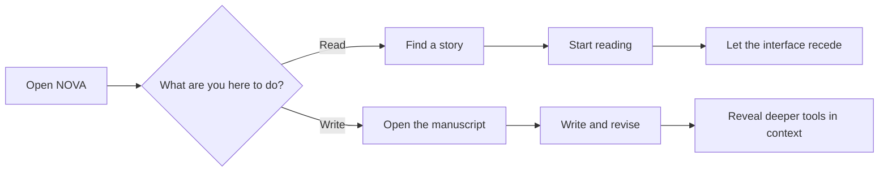

import { Tab, Tabs } from 'fumadocs-ui/components/tabs';

The easiest way to make a writing platform worse is to keep adding things to the screen.

Each new feature seems reasonable on its own: a recommendation rail, another metric, a publishing shortcut, a few more filters. Over time, the product starts demanding more attention than the work itself.

We do not want NOVA to feel like that.

NOVA needs to be capable. Writers should be able to revise, publish, collaborate, and manage large projects. Readers should be able to search for something unusually specific and find a story that fits. But that depth should not make the product feel crowded.

<Callout title="The principle" type="idea">
  As NOVA becomes more capable, the interface should feel quieter—not busier.
</Callout>

## Start with the reason someone opened the app

Most sessions begin with a straightforward intention.

A reader wants to find something worth reading. A writer wants to work on a manuscript. Everything else is secondary until it becomes relevant.



This sounds obvious, but it rules out a surprising number of bad decisions. A feature does not deserve permanent space just because it exists. A control does not need to be visible on every screen just because somebody might eventually use it.

## One platform, two kinds of attention

Readers and writers use the same product, but they need different things from it.

<Tabs items={['Reading', 'Writing']}> <Tab value="Reading">
A reader needs a clear path from curiosity to story. Search, recommendations, and filters matter before a story opens. Once reading begins, most of the product should step back.

```
The reading view should feel closer to a well-set page than a social feed.
```

  </Tab>

  <Tab value="Writing">
    A writer needs more structure: chapters, revisions, comments, publishing controls, and eventually collaboration.

```
That makes the workspace denser by necessity. The goal is not to hide useful tools. It is to keep the current task clear while making deeper controls easy to reach.
```

  </Tab>
</Tabs>

Trying to solve both modes with one universal layout would make each of them worse.

## Calm does not mean bare

A minimal interface is not automatically a good interface. Removing too much can make a product vague and frustrating.

The goal is clarity. Important actions should be visible. Related controls should sit together. Secondary options should remain nearby without competing for attention.

<Cards>
  <Card title="Make the next action obvious">
    A reader should know where to search. A writer should know where to begin drafting. The interface should not need to explain itself first.
  </Card>

  <Card title="Reveal depth in context">
    Version history belongs near revision. Collaboration controls belong near shared work. Advanced filters belong inside discovery, not everywhere.
  </Card>

  <Card title="Respond immediately">
    Saving, publishing, switching chapters, and applying filters should always produce clear feedback. Silence makes a product feel unreliable.
  </Card>

  <Card title="Leave room for the work">
    The story is not another card inside the interface. In the right moments, it should become the entire interface.
  </Card>
</Cards>

## Let complexity earn its place

NOVA has features that are inherently more involved than a basic writing app.

A manuscript may have branches. A chapter may have multiple revisions. Several writers may be editing the same project. Search may combine ordinary filters with semantic understanding.

The mistake would be presenting all of that complexity upfront.

A new writer should be able to create a story and start typing without first learning NOVA's internal model. When they need to compare revisions, the history should be there. When they invite someone else, collaboration tools should appear naturally. When a project grows, the interface should grow with it.

This is not about hiding features. It is about introducing them at the moment they become useful.

## Quiet systems still need to feel trustworthy

Some of the most important parts of a writing platform should barely be noticed when they are working properly.

Autosave is one example. Writers should not have to think about whether a chapter is safe. The product should show enough feedback to build confidence, then get out of the way.

The same applies to loading states and errors. A blank screen with a spinner makes the product feel uncertain. A stable layout with a clear placeholder tells the user what is happening. An error message should explain what failed and what can be done next.

Performance matters for the same reason. Speed is not only an engineering metric. It affects how confident the product feels.

## Discovery should feel like asking for a story

Readers do not always search in categories.

Sometimes they know the title or author. Often, they only know the shape of what they want: a slow political fantasy, a character-driven story with a specific dynamic, or something that feels like a book they finished last week.

NOVA should support both kinds of search.

Filters remain useful. Genres, tags, length, and completion status help readers narrow the results. But the interface should not force every search to become a database query. A reader should also be able to describe what they are looking for in ordinary language.

The system behind that can be sophisticated. The experience should not be.

## Do not make the product compete with the story

Many reading platforms are designed around constant stimulation: streaks, coins, pop-ups, rankings, and prompts to keep scrolling.

Those patterns can increase activity while making the product noticeably worse to use.

NOVA still needs recommendations, analytics, and community features. Writers should understand how readers are responding to their work. Readers should be able to discover stories through other people.

But those features should serve the reading and writing experience rather than taking it over. The product should not turn every creative decision into a metric to chase.

## Accessibility is part of the foundation

Accessibility is easy to postpone because it often does not look like a headline feature. That is precisely why it needs to be built into the system from the beginning.

Readable contrast, keyboard navigation, visible focus states, sensible touch targets, adaptable layouts, and reduced-motion support are not optional polish. They are part of making an interface dependable.

They also tend to improve the product for everyone else.

## A simple test for new features

Before adding something to the interface, we try to ask a few basic questions:

* Does this help with the task the user is doing right now?
* Does it need to remain visible when it is not being used?
* Could it appear closer to the moment it becomes relevant?
* Does the interaction still make sense on a small screen?
* What happens on a slow connection?
* What happens when the action fails?
* Can somebody use it without a mouse?

These questions do not always produce the smallest interface. They usually produce a better one.

## The standard

NOVA should feel considered without constantly drawing attention to its design.

A reader should remember the story they found, not the controls around it. A writer should be able to spend an hour inside a manuscript without feeling like they spent an hour operating software.

That is the standard: enough structure to make the product dependable, enough depth to support serious work, and enough restraint to know when to disappear.
