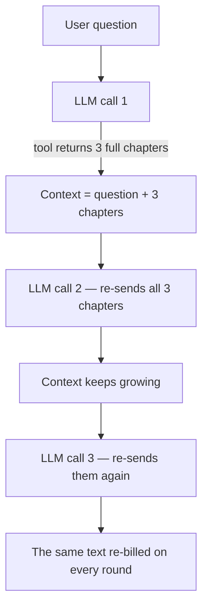
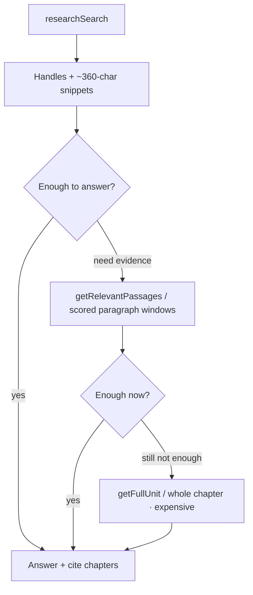

# Cutting Recall's RAG Cost Per Question From $0.10 to $0.04–0.06

**A teardown of how Recall's agentic RAG loop got cheaper — handle-based retrieval, progressive disclosure, opt-in reasoning, step budgets, and usage-derived pricing. No model swap required.**

---

> I cut my RAG agent's cost per question from about ten cents to four–six cents. Not by switching to a cheaper model. The model was already cheap. The waste was mostly architectural.

I run [Recall](https://recall.novusatlas.org), a research agent for fiction canon. You ask it questions about a 3,000-chapter web serial and it digs through the actual text, cites chapters, and refuses to spoil anything past where you've read. Under the hood it's an agentic RAG loop: an LLM calls search tools, reads evidence, and answers.

When I first got deep-reasoning questions working end to end, each one cost me around ten cents. Users pay in credits, and at ten cents a question the margin math just doesn't work for a product aimed at fanfiction writers. So I spent a while attacking the cost and got it down to four to six cents per question. Not by switching to a cheaper model. The model was already cheap.

> **The one rule.** Raw source text never sits in the model's context unless it has to. Almost every optimization below is a consequence of that.

## Why agentic loops get expensive

Cost in a tool-calling loop is _tokens per call_ times _number of calls_, and the two multiply against you. Every tool round resends the whole growing conversation as input tokens. If your search tool returns three full chapters and the model does eight rounds, you're paying to re-send those chapters seven more times. The naive version of this architecture is a token bonfire.

## Handles instead of text

The search tool doesn't return passages. It returns compact handles (`u1`, `w1`, that kind of thing) with a snippet of about 360 characters each. The model does its first pass of reasoning over handles and snippets, decides which threads are worth pulling, and only then requests actual text.

Yes, you're making the model work with less information. But in practice the snippets carry enough signal for relevance judgments, and the model turns out to be decent at knowing when it needs more. Most search results never get expanded at all, which means most of the corpus text the old version paid for was never used.

## Make the model climb a cost ladder

There are two retrieval tools. One returns targeted passages: scored, deduplicated paragraph windows matched against the query. The other returns a full chapter. The system prompt tells the model explicitly that passages are cheap and full chapters are expensive, and to only reach for the whole chapter when passage-level evidence provably isn't enough.

Evidence gets disclosed progressively: snippet, then passages, then the full unit, and each step has to be justified by the last one failing. The expensive path still exists. It's just no longer the default path.

## Reasoning tokens are opt-in

This one is a bigger lever than people expect. Reasoning tokens bill at output rates, and on hard questions the thinking can dwarf the answer. Recall has three modes, and reasoning is set to _none_ for quick and standard. Even deep mode only gets _low_ effort, never high.

| Mode | Reasoning effort | Tool-step budget |
| --- | --- | --- |
| Quick | none | 30 |
| Standard | none | 50 |
| Deep | low | effectively uncapped |

Most traffic is quick or standard. Turning reasoning off for the majority of requests was probably the single largest line item in the whole effort, and it cost nothing in answer quality that I could detect — because the hard part of these questions is retrieval, and the tool loop is doing that work anyway.

## The model is boring on purpose

The research model defaults to `deepseek-v4-flash`, at **$0.055 per million input tokens** and **$0.247 per million output**. That's an order of magnitude under frontier pricing. The requirement here isn't raw reasoning depth. It's reliable tool calling over a long loop, and the cheap model does that fine. Paying frontier rates to shuffle search handles around would be silly.

## Caps everywhere

Tool loops fail in a specific way: the model gets stuck searching instead of answering. I hit a version of this as an actual bug — an infinite generation that `maxOutputTokens` eventually contained — and the structural fix is a step budget. Quick mode gets 30 tool steps, standard gets 50, deep is effectively uncapped. The cap converts a pathological loop from an unbounded cost into a bounded one.

Conversation history gets the same treatment. Prior turns are budgeted to 128k tokens and truncated oldest-first, and artifact markers are stripped out of history before it's counted, so a big rendered artifact from three turns ago doesn't quietly re-inflate the input of every call after it.

## Charge what it actually cost

The pricing side follows the same philosophy. Each request sums the provider's actual reported per-step cost (OpenRouter reports this in usage metadata), falls back to a static per-token table only when a step doesn't report, applies a 1.2x safety multiplier, and converts to credits at a cent per credit, rounded up with a one-credit floor.

Usage-derived pricing means every optimization above flows straight through to what users get charged, instead of just padding my margin on a flat rate. A cheap question costs the user less. I think that's the honest way to price an agent, and it also keeps me from lying to myself about costs — the ledger is the provider's numbers, not my estimates.

## The tradeoff I haven't resolved

The spoiler boundary — the feature the whole product hangs on — is enforced in the prompt, not in the query layer. The user's furthest-read position gets injected into the system prompt, and the model has a dedicated refusal tool it invokes when a question would cross the line. Retrieval itself can technically surface future-chapter content. Correctness relies on the model choosing not to use it.

> **Not the safe design, the pragmatic one.** A hard sequence filter at the vector store would prevent leaks outright, and a determined prompt injection could in principle beat the current design. The prompt-enforced version ships and handles the honest-user case well, and the hard filter has real costs of its own around how evidence gets scored across the boundary. I'm not pretending it's the maximally safe option.

## Where it landed

|  | Before | After |
| --- | --- | --- |
| Cost per deep question | ~$0.10 | ~$0.04–0.06 |
| Search results | full chapters | handles + snippets |
| Reasoning | always on | opt-in (mostly off) |
| Tool loop | unbounded | step-budgeted |
| History | full replay | 128k budget, oldest-first |

Fewer calls, smaller calls, cheaper calls. A deep question that used to mean full-chapter dumps plus always-on reasoning plus an unbounded loop now spends most of its tokens on handles and short passages, and reserves the expensive stuff for when the evidence demands it. Ten cents down to four to six.

None of the individual pieces are novel. What surprised me is how much of the cost was pure discipline, in the sense that the model never needed most of the tokens I was feeding it. It just had no reason to refuse them.

And the cheaper version didn't get worse. One reader — a fanfiction writer working in the *Shadow Slave* canon — put it more plainly than any benchmark I could run:

> "Incomparably better than asking an assistant to search the Shadow Slave wiki."
>
> — A Shadow Slave fanfiction writer, on Recall

If you're building an agentic RAG loop and your costs look scary, read your per-step usage data before you touch the model picker. The waste is probably in what you're re-sending, and in reasoning you turned on because it felt like the serious thing to do.

## FAQ

**Did you switch to a cheaper model to get the savings?**

No. The model was already cheap (`deepseek-v4-flash`). Every saving here came from sending fewer and smaller tokens per call and from bounding the loop — the model picker was never the lever.

**Doesn't returning handles instead of text hurt answer quality?**

Not in any way I could measure. The ~360-character snippets carry enough signal for relevance judgments, and the model requests the full text when it genuinely needs it. Most search results never get expanded at all.

**Why is the spoiler boundary enforced in the prompt, not the query?**

Pragmatism. A hard sequence filter at the vector store would prevent leaks outright, but it has real costs around how evidence gets scored across the boundary. The prompt-enforced version ships today and handles the honest-user case well.

---

_Recall is live at [recall.novusatlas.org](https://recall.novusatlas.org). I'm a solo dev and I take on contract work in this exact area — RAG, retrieval, and LLM pipelines. [shaharyar.dev](https://shaharyar.dev) if that's useful to you._
