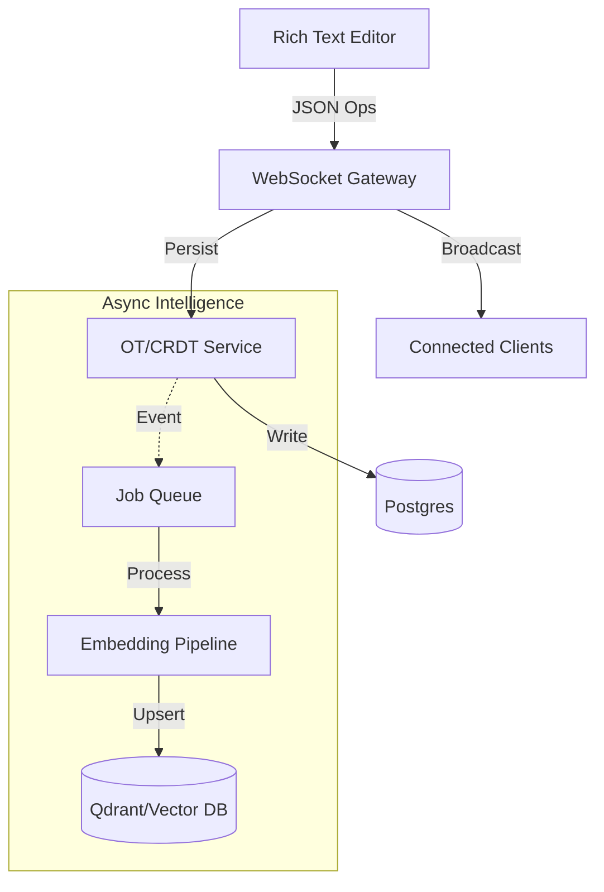

# NOVA: The "Figma for Fiction"

**A collaborative publishing platform that treats writing like code.**

---

## PROBLEM
**Traditional writing platforms are hostile to serious craft.**

Online fiction has a discovery problem. Platforms like Wattpad and WebNovel prioritize high-frequency updates over quality, forcing writers to churn out daily chapters to survive the algorithm.

Worse, the tooling is archaic. Writers are stuck in single-player text editors, copy-pasting into CMS forms, with no version control, no real-time collaboration, and no way to branch narratives.

**The Pain:**
- **No Collaboration:** Co-authoring requires emailing Word docs.
- **Black Box Algorithms:** Discovery is random and exploitative.
- **Zero Versioning:** "What if" scenarios require duplicating entire files.

## SOLUTION
**A custom-built "Figma-for-writing" with real-time syncing and semantic intelligence.**

NOVA (Novus Atlas) is a ground-up rewrite of the publishing stack. It brings software engineering tools to creative writing:

- **Branch-Based Versioning:** Git-like branching for alternate timelines and drafts.
- **Real-Time Multiplayer:** Google Docs-style collaboration with granular permissions.
- **Semantic Discovery:** A vector-based search engine that understands *theme* and *style*, not just keywords.
- **Transparent Ranking:** Open-source quality algorithms based on structural analysis, not just clicks.

## MY ROLE
**Solo Engineer & Designer.**

I built the entire stack from first principles:
- **Architecture:** Designed the OT/CRDT hybrid sync engine.
- **Frontend:** Built the rich-text editor and reactive UI in Next.js.
- **Backend:** Implemented the vector embedding pipeline and Node.js socket services.
- **DevOps:** Managed the Vercel/PostgreSQL infrastructure.

## THE HARD PART
**Syncing state across clients while analyzing meaning in real-time.**

The biggest technical hurdle was reconciling real-time collaboration with expensive semantic analysis.

1.  **Operational Transforms (OT) at Scale:**
    Allowing multiple authors to edit the same paragraph required a custom OT implementation to handle conflict resolution without locking the UI.

2.  **The "Cold Start" Problem:**
    How do you rank a story with zero views? I built a **Structural Analysis Pipeline** that scores text complexity, lexical diversity, and pacing *before* a single reader sees it.

3.  **Vector Search Costs:**
    Running embeddings on every save is too expensive. I architected a debounced pipeline that only re-indexes changed "semantic chunks" to keep costs manageable.

## ARCHITECTURE

## RESULTS

- **Status:** Closed Beta (Wave 1).
- **Performance:** Sub-2s page loads via Next.js SSR and edge caching.
- **Quality:** 90% TypeScript 10% Rust codebase with strict linting.
- **Documentation:** 9,000+ word [Design Philosophy](https://codex.novusatlas.org/blog/nova-design-philosophy) published.
- **Accessibility:** WCAG 2.1 AA compliance (Keyboard nav, OKLCH contrast).

> "NOVA represents my belief that technology should serve creators, not extract value from them."
