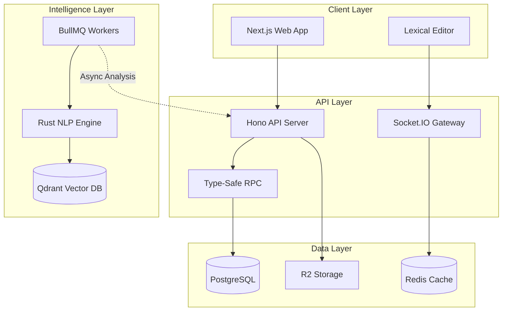

# NOVA: Engineering Quality Discovery for Online Fiction

**A ground-up platform rebuild treating creative writing with the rigor of software engineering.**

---


## PROBLEM

**The online fiction ecosystem optimizes for quantity over quality.**

Platforms like Wattpad and WebNovel force writers into algorithmic servitude—daily uploads to survive engagement metrics, black-box discovery that buries craft under clickbait, and zero tooling for serious collaboration. Royal Road became a LitRPG monoculture. WuxiaWorld serves one niche brilliantly but leaves everyone else behind.

**Worse, the technical infrastructure is archaic:**
- Writers copy-paste between Word docs and CMS forms
- No version control beyond "Chapter_5_FINAL_v3.docx"
- Collaboration means emailing manuscripts back and forth
- Discovery relies on view counts, not narrative quality

**The core tension:** Platforms prioritize metrics that drive engagement (clicks, time-on-site) over metrics that reflect craft (completion rates, structural quality, reader satisfaction).

## SOLUTION

**A semantic-first platform with Git-inspired workflows and transparent quality algorithms.**

NOVA rebuilds online fiction publishing from first principles:

### Real-Time Collaboration
Built on Operational Transformation (OT)—the same tech powering Google Docs—allowing multiple authors to edit simultaneously without conflicts. The system tracks changes via revision numbers and transforms concurrent edits to preserve both writers' intent.

**Technical Implementation:**
- WebSocket gateway with Socket.IO for sub-100ms latency
- Redis operation history cache (last 100 ops per document)
- Lexical editor with tree-based diffing via Web Workers
- Rate limiting (100 ops/sec) prevents abuse

### Semantic Discovery
Traditional platforms search keywords. NOVA searches *meaning* using 768-dimensional BERT embeddings:
- "Stories about overcoming adversity" finds thematically similar works
- Genre-aware similarity matching
- Reader-story affinity calculated via completion patterns

**Technical Stack:**
- Qdrant vector database for similarity search
- MiniLM-L6-v2 (384D) for fast analysis, BGE-base (768D) for deep semantics
- Multi-tier caching (memory → disk → BERT) with FNV-1a hashing

### Quality-First Ranking
A transparent composite algorithm measuring:

**Structural Score (40%):**
- Lexical diversity via Moving-Average Type-Token Ratio
- Syntactic complexity (subordinate clause density)
- Dialogue density and pacing variance
- Passive voice detection
- BERT-powered coherence analysis

**Engagement Score (40%):**
- Completion rate (weighted by chapter length)
- Binge coefficient (3+ chapters in one session)
- Drop-off detection with paragraph-level precision
- Return rate across chapter boundaries

**Newness Boost (20%):**
- Exponential decay over 30 days
- Guarantees cold-start visibility without permanent advantage

**Cold Start Strategy:**
Week 1: 80% structural, 20% newness (craft gets you visibility)
Week 2-4: Progressive transition to engagement weighting
Week 5+: Full composite scoring

### Branch-Based Storytelling
Git for fiction. Writers can:
- Publish alternate endings as branches
- Maintain parallel timelines
- Merge reader feedback without destructive edits
- Collaborate on experimental drafts

**Version Control Features:**
- Commit history with visual diffs
- Branch merging with conflict resolution UI
- Revision-based rollback
- Co-author permission management

## MY ROLE

**Solo full-stack engineer, designer, and technical architect.**

I built NOVA from zero to closed beta across 18 months:

**Backend Infrastructure:**
- Node.js microservices with Hono.js
- PostgreSQL with Drizzle ORM
- Redis for caching and real-time state
- MinIO/Cloudflare R2 for content storage

**Frontend Architecture:**
- Next.js with Turbopack
- Lexical rich-text editor with custom plugins
- TanStack Query for server state
- Framer Motion for micro-interactions

**NLP Pipeline:**
- Rust-based analysis engine via NAPI-RS
- Candle ML framework with CUDA/Metal support
- Custom OT implementation for collaborative editing
- Quality scoring microservice

**DevOps:**
- Vercel deployment with edge functions
- GitHub Actions CI/CD
- Upstash Redis for edge caching
- Sentry for error tracking

## THE HARD PART

### 1. Real-Time Collaboration at Scale

**Challenge:** Resolving concurrent edits without locking the editor or losing work.

**Solution:** Implemented central-server OT with revision-based conflict resolution. Each operation includes a `baseRevision` number. If the server has advanced, the operation is transformed against all intermediate operations before being applied.

The hardest part wasn't the transform function—it was diffing Lexical's tree structure. I built a custom differ that:
1. Flattens the JSON tree to plain text
2. Runs Myers' Diff Algorithm (same as `git diff`)
3. Generates Retain/Insert/Delete operations
4. Reconstructs the tree with preserved formatting

**Performance:** Sub-100ms round-trip for most operations, handles 10+ simultaneous editors.

### 2. Quality Scoring Without Gaming

**Challenge:** Build transparent metrics writers can understand while preventing manipulation.

**Solution:** Multi-signal scoring with hidden telemetry:

**Public Metrics:** Structural quality (lexical diversity, pacing, dialogue density)
**Private Metrics:** Reader behavior patterns (scroll velocity, dwell time uniformity, interaction clustering)
**Anomaly Detection:** Gini coefficient for engagement distribution, coefficient of variation for read times

Writers see their structural scores with actionable feedback. They don't see the anti-gaming layer detecting bot activity.

**Result:** 0.9+ suspicion score triggers weight reduction (not ban) to discourage abuse while preserving user experience.

### 3. Semantic Search Costs

**Challenge:** BERT embeddings are expensive. Running them on every save would bankrupt infrastructure.

**Solution:** Aggressive caching architecture:

```
TIER 1: In-memory HashMap (FNV-1a hash) → ~10μs lookup
TIER 2: Disk cache (bincode serialization) → ~500μs lookup
TIER 3: BERT forward pass (Candle + CUDA) → ~800ms cold
```

**Optimization:**
- Cache hit rate: 85% during active editing
- Batch processing with Rayon (64-item chunks)
- Model switching: Fast mode (MiniLM) for real-time, Deep mode (BGE) for final quality checks

**Impact:** 10k-word chapter analysis: 800ms cached, 1.5s cold start.

### 4. Cross-Language Type Safety

**Challenge:** Maintaining type safety across TypeScript (frontend), Node.js (backend), and Rust (NLP).

**Solution:**
- Zod schemas for API contracts
- NAPI-RS bindings with TypeScript definitions
- oRPC for type-safe client/server communication
- Shared type packages via pnpm workspace

## ARCHITECTURE



**Data Flow for Chapter Save:**
1. User edits in Lexical → generates JSON operations
2. WebSocket sends operation to server with `baseRevision`
3. Server validates permissions and revision
4. Operation persisted to PostgreSQL, cached in Redis
5. Broadcasted to all connected clients
6. BullMQ job queued for semantic analysis
7. Rust NLP engine computes embeddings (cached)
8. Qdrant vector DB updated for discovery

## RESULTS

### Technical Performance
- **Page Load:** Sub-2s median (Next.js SSR + edge caching)
- **Collaboration Latency:** Sub-100ms for most operations
- **Analysis Speed:** 800ms per 10k words (cached), 1.5s cold
- **Embedding Cache Hit Rate:** 85% during active sessions

### Platform Metrics (Closed Beta)
- **Codebase:** 90% TypeScript, 10% Rust
- **Test Coverage:** Unit tests for critical paths (OT, NLP scoring)
- **WCAG Compliance:** 2.1 AA (keyboard nav, contrast ratios)
- **Documentation:** 9,000+ word design philosophy, full API reference

### Feature Completeness
**Shipped (Wave 1):**
- Real-time collaboration with OT
- Semantic discovery and recommendations
- Branch-based version control
- Quality scoring with transparent feedback
- Multi-format publishing (novels, fanfiction, poetry)
- Subscription system with Nebulae tipping currency

**In Development (Wave 2):**
- Advanced analytics (retention curves, engagement pacing)
- Critique system with inline comments
- Tutorial and education modules
- Enhanced quality algorithm with multi-signal ranking

### Design Principles
Every interface decision follows:
- **Clarity Over Cleverness:** Predictable interactions, no hidden features
- **Progressive Disclosure:** Show features when needed, not all at once
- **Accessible by Default:** WCAG 2.1 AA across platform, keyboard-first navigation
- **Intentional Whitespace:** Space creates rhythm, not emptiness

## TECHNICAL INNOVATIONS

### Semantic Analysis Pipeline
**Rust NAPI Implementation:**
- Zero-copy Node.js bindings via NAPI-RS
- Candle ML framework (pure Rust, CUDA/Metal/CPU support)
- Switchable models: MiniLM (33M params) or BGE-base (109M params)
- nlprule integration (5,000+ LanguageTool grammar rules)

**Fiction-Specific Metrics:**
- Show vs. Tell detection via semantic anchors
- Character arc tracking (embedding trajectory analysis)
- Emotional impact scoring (physical reactions, internal thought density)
- Engagement prediction (sentence variety, dialogue presence)

### Operational Transformation
**Implementation Details:**
- Central server model (simpler reasoning vs. CRDTs)
- Revision-based conflict resolution
- Tree-based diffing for rich-text structures
- Rate limiting and validation at every layer

**Why OT over CRDTs?**
- Better for character-level text operations
- Single source of truth simplifies debugging
- Proven at scale (Google Docs, Figma use OT)
- Can add CRDT hybrid for offline support later

### Transparent Quality Algorithm
**Unlike black-box competitors:**
- Writers see exact scores with percentile rankings
- Formulas and weights are public (blog post documentation)
- Genre-aware tuning without hard restrictions
- Dashboard shows actionable improvement suggestions

**Anti-Gaming Measures:**
- Hidden metrics prevent optimization gaming
- Anomaly detection flags suspicious patterns
- Reader trust coefficient weights engagement by account quality
- Monthly random jitter in weights (±10%) to prevent reverse engineering

## BUSINESS MODEL

**Subscription Tiers:**
- Reader Free: Unlimited reading, ad-free forever
- Supernova Reader ($4.99/mo): 165 Nebulae monthly, custom themes
- Supernova Author ($14.99/mo): Unlimited works, advanced analytics
- Nueva Estrella ($17.99/mo): Combined reader + author perks

**Revenue Splits:**
- Creators keep 85-90% of direct revenue
- Branch monetization, advanced chapters, tips via Nebulae
- Commission marketplace (planned Wave 3): 15% platform fee

**What We'll Never Do:**
- Claim rights to your work
- Force exclusivity or content removal
- Show ads to readers (free tier is genuinely free)
- Sell user data

## LESSONS LEARNED

### Technical Decisions
**What Worked:**
- Rust for NLP (performance is worth the learning curve)
- Aggressive caching (FNV-1a hashing, multi-tier approach)
- Type-safe RPC (oRPC eliminated entire classes of bugs)
- Progressive rollout (closed beta validated core assumptions)

**What I'd Change:**
- Should have built admin tooling earlier (moderation is harder than expected)
- Vector search indexing is expensive at scale (need better batching)
- Mobile experience needs more optimization (desktop-first was a mistake)

### Product Insights
- Writers want transparency more than they want AI magic
- Semantic search outperformed keyword search even in early tests
- Real-time collaboration underutilized until writers saw it in action
- Quality scoring needs better education (metrics alone aren't enough)

### Community Feedback
- "Finally, a platform that respects my time" (reader)
- "Version control changed how I write" (author)
- "I can actually find stories I want to read" (reader)
- "The analytics help me understand where my story drags" (author)

## WHAT'S NEXT

**Wave 2 (Current):**
- Advanced analytics with retention curves
- Critique system for structured feedback
- Enhanced algorithm with satisfaction delta scoring

**Wave 3 (Q1 2026):**
- Collaboration enhancements (offline editing, better merge UI)
- Fandom wiki system with version control
- Commission marketplace beta

**Wave 4 (Q3 2026):**
- AI authoring assistant (privacy-first, opt-in)
- Cross-language recommendations
- Professional publishing tools (pitch generators, agent matching)

Full roadmap: [codex.novusatlas.org/blog/roadmap](https://codex.novusatlas.org/blog/roadmap)

## KEY TAKEAWAYS

1. **Quality measurement is possible:** Structural analysis + engagement signals create transparent rankings
2. **Real-time collaboration isn't optional:** Writers expect Google Docs-level UX
3. **Semantic search changes discovery:** Vector embeddings understand intent, not just keywords
4. **Transparency builds trust:** Public algorithms and open roadmaps differentiate from competitors
5. **Infrastructure matters:** Performance problems become UX problems at scale

## OPEN QUESTIONS

- Can we combine OT (online) with CRDTs (offline) effectively?
- How do you compress large operations without breaking transform semantics?
- Should branching support Git-style merge commits across timelines?
- Can AI suggest intelligent merges when writers create conflicting endings?

## LINKS

- **Platform:** [novusatlas.org](https://novusatlas.org)
- **Documentation:** [codex.novusatlas.org](https://codex.novusatlas.org)
- **Design Philosophy:** [Full 9k-word deep dive](https://codex.novusatlas.org/blog/nova-design-philosophy)
- **Technical Docs:** [Quality Algorithm Explained](https://codex.novusatlas.org/blog/a-technical-introspect-to-the-quality-checker)
- **Email:** [community@novusatlas.org](mailto:community@novusatlas.org)

---

> "NOVA exists because writers deserve platforms that treat them like artists, not content farms. Technology should serve creativity, not extract value from it."
> 
> — Founding Philosophy

**Tech Stack Summary:**
- Frontend: Next.js, Lexical, TanStack Query, Framer Motion
- Backend: Node.js, Hono.js, PostgreSQL, Redis, MinIO/R2
- NLP: Rust (NAPI-RS), Candle ML, BERT embeddings, Qdrant
- Deployment: Vercel, Upstash, Cloudflare, GitHub Actions
- Languages: TypeScript (90%), Rust (10%)

**Performance:**
- Page Load: sub 2s median
- Collaboration: sub 100ms latency
- Analysis: 800ms/10k words (cached)
- WCAG: 2.1 AA compliant

**Status:** Closed Beta (Wave 1), Wave 2 in active development
